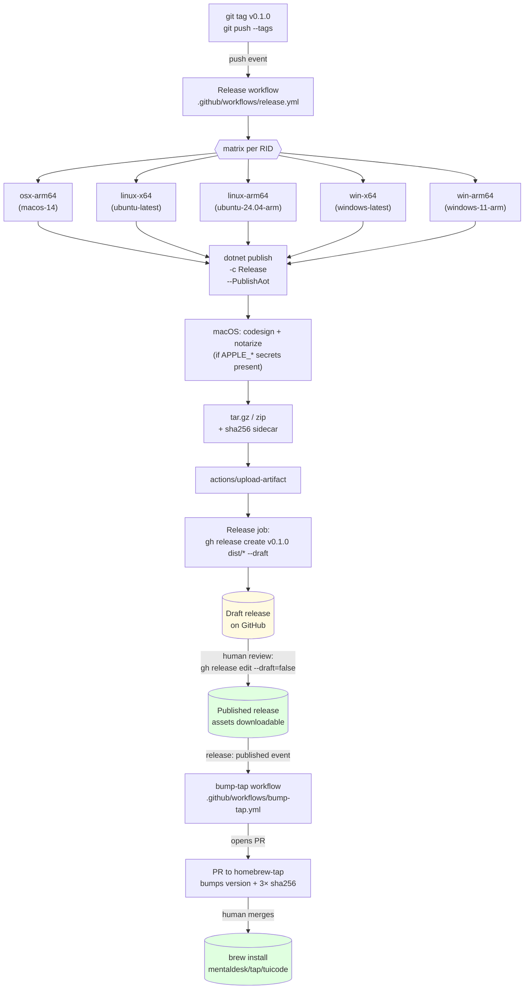
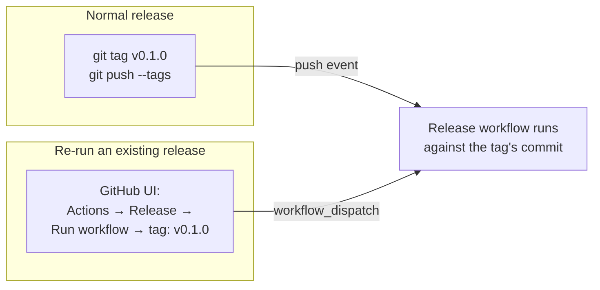
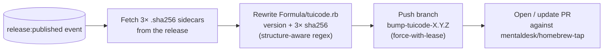
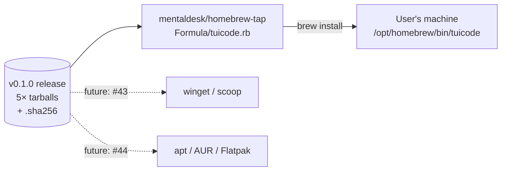

# Contributing

For code-level conventions (branch names, key handling, AOT gotchas, test framework), see [AGENTS.md](AGENTS.md). This doc covers the higher-level workflows — chiefly how releases happen.

## Branches and commits

- Features: `milestone-N-<slug>` (where `N` matches the milestone issue).
- Cleanup: `chore/<slug>`.
- Bug fixes: `fix/<slug>`.
- One branch per change. (Agents must additionally use a dedicated worktree per branch — see [AGENTS.md § Conventions](AGENTS.md#conventions).)
- Open PRs as **drafts** until you've verified them locally; mark ready when you're confident.
- Commit subjects: short imperative ("Add X", not "Added X"). Body explains *why*, not *what*.

## Releases

A release is a `v*` git tag plus a GitHub Release attaching native single-file binaries for every supported runtime. The pipeline is tag-driven: pushing the tag triggers everything else.

### End-to-end flow



The release pipeline gates on two human decisions: pushing the tag (shipping intent) and publishing the draft (assets-look-good check). Everything else is automated.

### Two ways to fire the workflow



Use the dispatch path when a tag is already pushed but a build step failed (e.g. a flaky notarization upload) and you want to retry without bumping the version. Tags should be immutable; never delete and re-push a tag.

### Why a draft release?

`gh release create … --draft` gives you a chance to spot-check the artifacts before they go public:

- Five tarballs/zips with the expected names and sizes.
- `.sha256` sidecar for each.
- macOS tarball is signed (if you've added the `APPLE_*` secrets — see [AGENTS.md § Release workflow](AGENTS.md#release-workflow)).

Once you publish (`gh release edit <tag> --draft=false` or "Publish release" in the GitHub UI), the asset URLs become unauthenticated-downloadable. **This is what unblocks `brew install`** — draft assets 404 for unauthenticated clients.

### Auto-bumping the Homebrew formula

A second workflow, `.github/workflows/bump-tap.yml`, listens for `release: published` events. When you flip a draft to published (or create a non-draft release), it:



The PR is opened with a fine-grained PAT (`HOMEBREW_TAP_TOKEN`) scoped only to `mentaldesk/homebrew-tap` with Contents + Pull requests write. Tap CI runs `brew style`, `brew audit --strict --online`, and a full install/test/uninstall cycle on macOS arm64, Linux x64, and Linux arm64. Merge once it goes green.

Prereleases (e.g. `v0.1.0-rc1`) are skipped — the `prerelease` flag on the release event short-circuits the job.

### Cutting a release

```bash
# from main, with everything you want to ship merged in
git fetch origin && git checkout main && git pull --ff-only

# tag and push
git tag v0.1.0
git push origin v0.1.0

# wait ~3 min for the workflow, then sanity-check the draft
gh release view v0.1.0 --web

# publish
gh release edit v0.1.0 --draft=false

# (auto) bump-tap fires; review + merge the resulting PR on mentaldesk/homebrew-tap
```

### Distribution



The Homebrew formula points at the release tarball URL with a pinned SHA256. The bump-tap workflow (above) opens the PR; you just review and merge.

For the iTerm2 dynamic profile that ships alongside `tuicode` on macOS, see the formula's `caveats` block and [#40](https://github.com/mentaldesk/TuiCode/issues/40) for the umbrella story across other terminal emulators.
