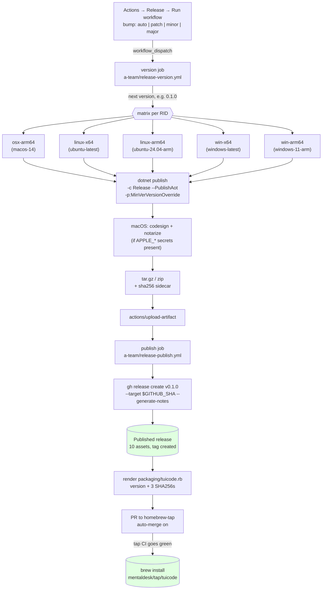
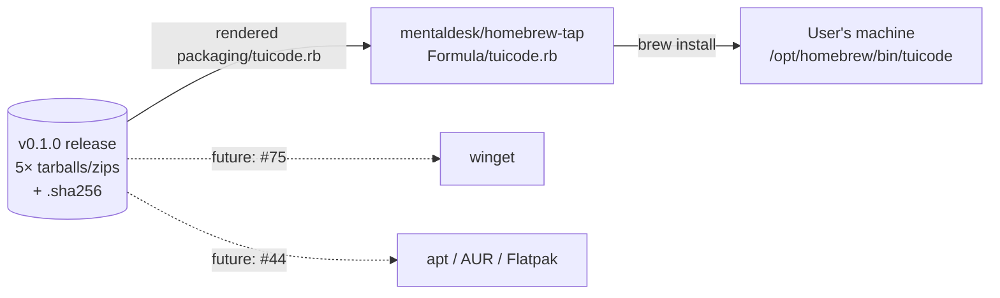

# Contributing

For code-level conventions (branch names, key handling, AOT gotchas, test framework), see [AGENTS.md](AGENTS.md). This doc covers the higher-level workflows — chiefly how releases happen.

## Branches and commits

- Features: `milestone-N-<slug>` (where `N` matches the milestone issue).
- Cleanup: `chore/<slug>`.
- Bug fixes: `fix/<slug>`.
- One branch per change. (Agents must additionally use a dedicated worktree per branch — see [AGENTS.md § Conventions](AGENTS.md#conventions).)
- Open PRs as **drafts** until you've verified them locally; mark ready when you're confident.
- Commit subjects: short imperative ("Add X", not "Added X"). Body explains *why*, not *what*.

## Releases

A release is a `v*` git tag, a GitHub Release attaching native single-file binaries for every supported runtime, and a Homebrew formula pointing at them. It all happens from the Actions tab — nothing is done locally, and no tag is pushed by hand.

Version-picking and publishing are [a-team's reusable workflows](https://github.com/mentaldesk/a-team), pinned to a released tag. `release.yml` keeps TuiCode's own build matrix — five RIDs, AOT, macOS signing and notarisation — and calls the shared ones on either side of it, so there's one release flow to maintain rather than two that drift.

### Cutting a release

Actions → **Release** → *Run workflow* → *Run workflow*. That's it.

The **Bump** dropdown defaults to `auto`, which reads the labels of PRs merged since the last release: `breaking` → major, `enhancement` → minor, otherwise patch. Choose `patch`, `minor` or `major` to override it.

### End-to-end flow

The shared publish job creates the tag, so a build that fails on any platform (the matrix is `fail-fast`) leaves no tag behind and nothing to clean up. `concurrency: release` keeps two dispatches from racing for the same version. Re-running the workflow after a successful publish picks the *next* version — tags are immutable; never delete and re-push one.

The release is published outright rather than as a draft: draft assets 404 for unauthenticated clients, which is what `brew install` is. The gate that used to be "publish the draft" is now the tap's own CI (`brew style`, `brew audit --strict --online`, and a full install/test/uninstall cycle on macOS arm64, Linux x64 and Linux arm64), which has to go green before auto-merge lands the formula.

### The formula template

`packaging/tuicode.rb` is the tap's formula with the version and the three SHA256s replaced by `{{version}}`, `{{sha_osx_arm64}}`, `{{sha_linux_x64}}` and `{{sha_linux_arm64}}`. The shared publish job renders it from the archives it downloaded and fails the job on a placeholder nothing filled — `PackagingTemplateTests` catches a typo'd one before the release rather than during it. The formula has no `version` line: `brew audit --strict` rejects one that duplicates the URL.

The tap PR is opened with `HOMEBREW_TAP_TOKEN`, a fine-grained PAT scoped to `mentaldesk/homebrew-tap` with Contents + Pull requests write. Without that secret the release still publishes and the job warns.

### Distribution

The Homebrew formula points at the release tarball URL with a pinned SHA256. Both the PR and its merge are automatic; `brew upgrade tuicode` picks up the new version once it lands, and `tuicode`'s About dialog reports the same number.

For the iTerm2 dynamic profile that ships alongside `tuicode` on macOS, see the formula's `caveats` block and [#40](https://github.com/mentaldesk/TuiCode/issues/40) for the umbrella story across other terminal emulators.
